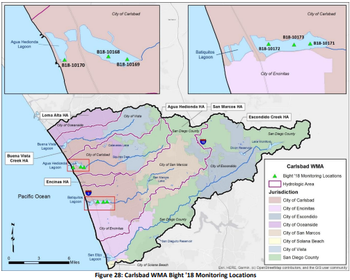
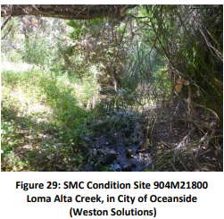
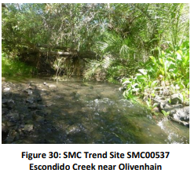
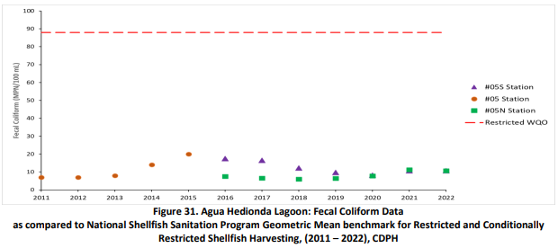
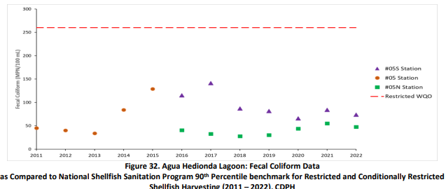
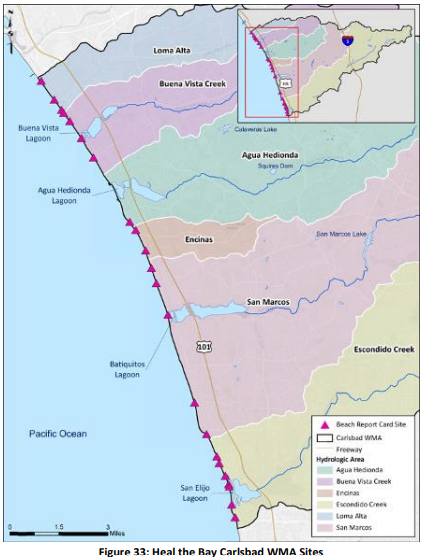
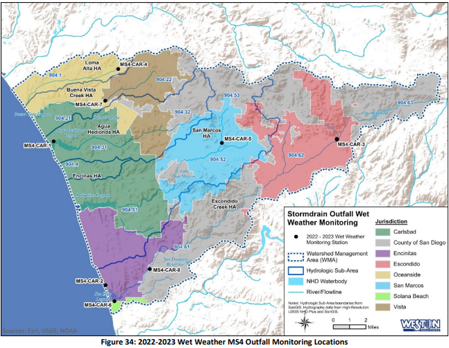
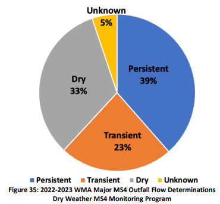

# Section 4: Water Quality Assessment Program

The WQIP outlines the four major elements of the Water Quality Monitoring and Assessment Program:
1. Monitoring to assess progress toward goals and
schedules,
2. Receiving water monitoring program that measures
the long-term health of the WMA during dry and wet
weather conditions,
3. MS4 outfall monitoring program to investigate and
eliminate unauthorized dry weather flows from MS4
outfalls and the improvement in quality of the
discharges from storm drains during wet weather, and
4. Special studies that address data gaps or provide
information to more effectively address pollutants or stressors that cause or contribute to an
HPWQC.
Monitoring information used to assess progress toward goals and schedules is included in each applicable
Goal section of this annual report (Section 3). Tables 11 through 13 provide a list of WQIP monitoring
programs and identify where information for those programs is located. This Annual Report includes
monitoring information collected during the 2022-2023 monitoring year and the respective assessments
required by the MS4 Permit. The 2022-2023 monitoring data is submitted to CEDEN, provided on the
Project Clean Water website (Regional Clearinghouse), and included in individual attachments to this 
report.

>**Wet Weather** is defined as a storm
event of >0.1 inch of rainfall and the
following 72 hours after the end of
rainfall.

>**Dry Weather**  is defined as all days
where the preceding 72 hours have
been without measurable precipitation
(>0.1 inch).

---

## 4.1 Receiving Water Monitoring

The sections below summarize the receiving water monitoring conducted during the reporting period. Long-term receiving water monitoring is required once per permit term and was completed in the 2014-2015 monitoring and assessment program period. The next receiving water monitoring is anticipated after the MS4 Permit is reissued and adopted. Receiving water monitoring related to WQIP goals is presented in the applicable HA sub-sections in Section 3 of this report.

#### 4.1.1 Southern California Bight Regional Monitoring Program

The Southern California Bight 2023 Regional Monitoring Program (Bight ’23) completed its sampling efforts during the summer and early fall of 2023. See Figure 28 for monitoring locations. The results of the monitoring are expected to be included in the FY24 WQIP annual report.

The Bight ’18 was the 7th iteration of a multi-agency (including Carlsbad WMA RAs) collaborative effort led by the Southern California Coastal Water Research Project (SCCWRP). Bight program participants develop, plan, and implement a monitoring program to answer specific questions during each five-year program cycle. Planning documents for Bight ’18 were completed in 2018. Five final assessment reports are available on the SCCWRP website, and the remaining reports will be available online as they are completed.

The following sections present findings from the Sediment Quality sampling efforts in 2018, confirmation monitoring efforts in 2019, and source identification efforts from this reporting period.

##### 4.1.1.1 Sediment Quality Sampling

Sediment quality (chemistry, toxicity, and benthic infauna) sampling in the Carlsbad WMA was performed at six locations (three locations in both Agua Hedionda Lagoon and Batiquitos Lagoon) on September 11 and 12, 2018 (Table 14 and Figure 28). Final sediment quality objective (SQO) station level assessments for each station in the two lagoons and individual lines of evidence are provided in Table 15.

### Table 14: Bight ’18 Sampling Locations within the Carlsbad WMA

### Figure 28: Carlsbad WMA Bight '18 and Bight ’23 Monitoring Locations

#### 4.1.1.2 Confirmation Monitoring 
In September 2019, the RAs initiated an investigation to confirm and characterize the Possibly Impacted
station in each lagoon and collected additional information at the Likely Impacted stations identified
through the sediment monitoring efforts in 2018. Confirmation monitoring was performed per the
Sediment Quality Objectives Confirmation Monitoring Work Plan (Weston Solutions, 2019), and results
are presented in Table 16.

### Table 16: Confirmation Monitoring Mean SQO Results (September 2019)

#### 4.1.1.3 Sediment Stressor Identification 
After confirmation monitoring, the RAs prepared and submitted a Stressor Identification Work Plan
(Weston, 2021) to the RWQCB to identify and understand sources of water quality impacts. The RWQCB
approved this work plan in May 2021, and field sampling was performed in FY22. The Sediment Stressor
Identification Study Report (FY22 Carlsbad WQIP Annual Report - Attachment 8) presents the September
2019 Confirmation Monitoring efforts and provides a detailed analysis and discussion of stressor
identification results.

Toxicity Identification Evaluations (TIEs), chemistry and biological analyses, and historical data from
previous surveys within Agua Hedionda Lagoon and Batiquitos Lagoon were used for the Sediment
Stressor Identification Monitoring study. This information was used to identify if the monitoring stations'
stressors were related to toxic pollutants in the sediments or disturbancesto the water column. The study
included three sites: two sites in Agua Hedionda Lagoon (B18-10168 and B18-10169 and one in Batiquitos
Lagoon (B18-10171).

For one site in Agua Hedionda Lagoon (B18-10168) and the site in Batiquitos Lagoon (B18-10171), TIE
efforts were initiated to determine the cause of toxicity. There were no causal sources of toxicity
identified, and ultimately a determination of the cause of toxicity in sediments was not found for either
site.

Low chemistry and toxicity scores suggest that chemical exposure at Agua Hedionda Lagoon site B18-
10169 was not a source of biological disturbance, therefore, a TIE was not performed at the site. Based 
on the benthic community stressor evaluation, the benthic community was typical of a southern California 
shallow-water lagoon and did not appear to be negatively impacted by chemically mediated effects. 
Agua Hedionda Lagoon is highly dynamic and influenced by conditions such as tides, currents, eddies,
recreational activities, groundwater exchange, and freshwater input. While not quantified, anthropogenic
physical disturbance (e.g., boat wash, paddle disruption, boat groundings, tramping via paddlers wading,
etc.) may be a potential cause of the sediment results.
In FY23, the RAs continued coordinating with RWQCB staff regarding data and potential next actions. RAs 
stated their intent is to move forward with participating in the Bight ’23 program and collecting and 
analyzing samples at the sites in question. Based on the results, RAs will coordinate with RWQCB staff on 
the next actions, if any.

### 4.1.2 Storm Water Monitoring Coalition Regional Bioassessment Program 
The Southern California Storm Water Monitoring Coalition (SMC) began an approach to evaluate the biological condition of California’s wadeable streams in southern California’s coastal watersheds in 2009. The RAs have participated in the monitoring effort since the program’s inception. The first five years (2009-2013) of this program established a baseline for monitoring trends. In 2021, the third iteration of the 5-year SMC Work Plan was initiated to build off the initial surveys (SCCWRP 2021).

>**2021-2025 Storm Water Monitoring Coalition
(SMC) Bioassessment Program** 
What are considered **“Trend”** sites are sampled either once during
the five-year work plan (i.e., ‘Panel 1’ Trend
sites) or sampled 3 to 4 times during this
monitoring cycle (i.e., ‘Panel 2’ Trend sites).
**“Condition”** sites are randomly selected and
do not remain consistent from year to year.

In accordance with the SMC Workplan, the monitoring conducted during the 2022-2023 monitoring year incorporated the following components:
- Benthic macroinvertebrate (BMI) sample collection and identification
- Diatom sample collection and identification, soft-bodied algae collection for archive
- Water quality chemistry sample collection and analysis
- Physical habitat (PHAB) assessment
- Physical riparian habitat assessment (California Rapid Assessment Method (CRAM))

During the 2022-2023 monitoring year, monitoring was conducted at two sites. The first was condition site 904M21800, which is situated on Loma Alta Creek in the City of Oceanside. This site was visited on June 28, 2023. The second site was panel 2 trend site SMC00537, a natural bottom channel in the Escondido Creek HA. This site was visited on June 27, 2023. Bioassessment metrics are summarized in
Table 17, and results are presented in Table 18.

### Table 17: Bioassessment Metrics

### Table 18: SMC Regional Bioassessment Program Reporting Period BMI and Algae Results Summary

>1 CRAM score of 76 and 78 indicates a high capacity to perform beneficial habitat functions.
2 Duplicate sample scored 0.47, Very Likely Altered condition class.
3Duplicate sample scored 0.44, Very Likely Altered

The Loma Alta Creek condition site, 904M21800, (see Figure 29) has biological community scores indicating that the BMI community is likely altered (CSCI score of 0.71), while the diatom community appears degraded (ASCI score of 0.72, Very Likely Altered). Several studies have demonstrated that the BMI community responds strongly to physical habitat and hydrologic-regime related stressors, whereas the algal community responds to nutrient and water chemistry-related stressors (Theroux, 2020, Mazor, 2015). 

A CRAM score of 58 indicates that some measures of physical habitat at 904M21800 are of moderate quality. The lowest scoring CRAM attribute sub-score was related to limited habitat buffer due to the site proximity to urban development. SWAMP physical habitat assessment measures indicate the stream is limited in flow habitat diversity, composed primarily of glides and pool habitat with few riffles. While all of the water quality analytes were below their respective benchmarks specific conductivity, chloride, total hardness, and sodium values were relatively high. 

Station 904M21800 scored poorly for three of the six diatom ASCI sub metrics indicating an abundance of diatom taxa tolerant to disturbance, taxa tolerant of eutrophic conditions, and taxa tolerant to increased salinity environments.

### Figure 29: SMC Condition Site 904M21800

Loma Alta Creek, in City of Oceanside (Weston Solutions)

The biological community index scores at site SMC00537 indicate that the BMI and diatom algal communities are Very Likely Altered (CSCI score of 0.42, ASCI score of 0.53). The physical habitat at SMC00537 is of relatively high quality, as indicated by the CRAM score of 76. However, the stream bed is of low gradient, and the riparian buffer community is of limited width and habitat quality. Specific conductivity, chloride, sulfate, and total nitrogen values at SMC00537 were elevated (Table 3-4). 

Specific conductivity is a measurement of the ability of water to conduct electricity where dissolved ions (i.e., Na+, Ca+2, SO4-2, etc.) serve as the conductor (Clean Water Team [CWT] Fact Sheet-3.1.3.0(EC)V2e, 2004). As such, specific conductance is related to TDS content. Although the effect of elevated TDS on BMI is variable among different taxa and not well understood, several studies have demonstrated a correlation between changes in conductivity/TDS and both altered BMI (Minshall and Minshall, 1978) and algal communities (Leland and Porter, 2000). 

Results from the first SMC five-year report suggested that elevated TDS is a condition common to the entire region, affecting 76% of stream miles in southern California (Mazor, 2015). Station SMC00537 scored poorly for five of the six diatom ASCI sub-metrics indicating an abundance of diatom taxa tolerant to disturbance, taxa tolerant of eutrophic conditions, and taxa tolerant to increased salinity environments.

### Figure 30: SMC Condition Site 904M21800

Loma Alta Creek, in City of Oceanside (Weston Solutions)

Refer to Attachment 4 for results and details on the 2022-2023 Stream Bioassessment Monitoring.

### 4.1.3 Agua Hedionda Lagoon 

The following efforts were performed during the reporting period as part of the Agua Hedionda Phased Approach Addressing Indicator Bacteria to protect SHELL and REC-1 Beneficial Uses in Agua Hedionda Lagoon – see Appendix D for details.

#### 4.1.3.1 SHELL Beneficial Use 

Phase I of the Agua Hedionda SHELL approach aims to assess whether water quality in Agua Hedionda Lagoon supports commercial shellfish harvesting under open conditions. Attainment of the Phase I objective is supported by the continued implementation of strategies to improve water quality in the Lagoon and a monitoring and assessment component focused on evaluating available monitoring data within the shellfish growing area. 

FY23 strategies implemented by RAs include:

- Bacteria reduction strategies (e.g., property-based inspections, outreach to homeowners’ associations, irrigation runoff reduction)
- Human source reduction strategies (e.g., strategies to address homelessness, Sanitary Sewer Management Plans (SSMPs), Onsite Wastewater Treatment System (OWTS) investigations)
- The City of Carlsbad and County of San Diego participated in a Bacteria Summit to discuss water 
safety standards and research needs. Key takeaways include the need for more research, 
collaboration among agencies, and the interest in a shellfish safety index.

>5 Beneficial uses for commercial shellfish harvesting are monitored and managed by the California Department of 
Public Health (CDPH). Open condition refers to the time period in which shellfish harvesting is allowed by CDPH. 
CDPH practice throughout the State is to suspend harvesting operations following rain events. In Agua Hedionda 
Lagoon the threshold for “closure” is defined as >0.4” over a 24-hour period with a closure length of 72 hours. In the 
case of extreme weather events, defined as >1.5” over 24 hours or >3.00” over 7 days, harvesting is closed 
indefinitely until sample results are below thresholds established by the National Shellfish Sanitation Program 
(NSSP). All harvested shellfish are also subject to a depuration process to ensure that they are safe for consumption. 
Thisis common practice due to the filter feeding nature ofshellfish and is not indicative of beneficial use impairment, 
but rather practical management of shellfish harvesting operations to protect public health.

Monitoring data, see Figure 31 and Figure 32, in the shellfish growing area met quality benchmarks, 
supporting the SHELL beneficial use. Still, efforts are needed to deter birds from roosting among the 
growing lines, as they contribute to contamination in shellfish tissue.

### Figure 31. Agua Hedionda Lagoon: Fecal Coliform Data

### Figure 32. Agua Hedionda Lagoon: Fecal Coliform Data

#### 4.1.3.2 REC-1 Beneficial Use 

The objective of Phase I of the REC-1 Approach was to determine whether water quality conditions continue to support the REC-1 beneficial uses as indicated in previous studies (MACTEC, 2009; State Water Board, 2010). A monitoring and assessment component completed in September 2022 demonstrated that the REC-1 beneficial use is supported.

As stated above, the RAs continue implementing strategies to improve water quality in the Lagoon and more effectively communicate potential water quality concerns to the public, including:

- Bacteria reduction strategies (e.g., property-based inspections, outreach to homeowners’ associations, irrigation runoff reduction)
- Human source reduction strategies (e.g., strategies to address homelessness, Sanitary Sewer Management Plans (SSMPs), Onsite Wastewater Treatment System (OWTS) investigations)
- Improved the signage posted at public access points to the Lagoon

---

## 4.2 Additional Receiving Water Assessment 

Heal the Bay, an environmental non-profit organization, develops an annual beach report card designed to provide beachgoers with reliable beach water quality information. The 2022-2023 Annual Beach Report Card (2023, Heal the Bay) is a summary of the past year’s water quality, specifically Fecal Indicator Bacteria (FIB), for three distinct periods:

- Summer dry weather – April 2022 through October 2022
- Winter dry weather – November 2022 through March 2023
- Year-round wet weather conditions – April 2022 through March 2023

The Report Card classifies beaches along the West Coast (Washington, Oregon, and California) on an A through F grading scale. The complete report is included as Attachment 5 and the grading methodology is provided in the report.

Based on the review and analysis of FIB sampling data, no Carlsbad WMA beaches were placed on the Beach Report Card’s Honor Roll. In past years, six Carlsbad WMA beaches were consistently Honor Roll beaches. For a beach to make the Honor Roll, the beach had to have been monitored weekly year-round and receive only exceptional (A+) grades during all seasons and weather conditions. Per Beach Report Card, “only two out of over 500 monitored beaches made it on the Honor Roll compared to 51 last year. Unfortunately, the unprecedented amount of rain that fell across California during the 2022–2023 winter led to an enormous dip in water quality and a very short Honor Roll list.”

22 Carlsbad WMA sites were assigned grades in the Beach Report Card:

- 85% of the 13 sites monitored during the summer dry weather period received an A+ or A grade.
- 75% of the 4 sites monitored during the winter dry weather period received an A+ or A grade.
- 52% of the 21 sites monitored during the year-round wet weather period received an A+, A, or B grade.

>Samples taken during or within 72 hours of a rain event. Heal the Bay used a definition of a rain event in California as
precipitation greater than or equal to one tenth of an inch (>=0.1”).

### Figure 33: Heal the Bay Carlsbad WMA Sites

---

## 4.3 MS4 Outfall Monitoring 

During the reporting period, the RAs conducted the MS4 Outfall Monitoring Program to monitor the discharges from the priority MS4 outfalls within the Carlsbad WMA during dry and wet weather conditions. The 2022-2023 wet and dry weather monitoring results for the MS4 Outfall Monitoring Program are summarized in the following sections. Detailed information and assessments are provided in Attachment 3.

##### 4.3.1 Wet Weather MS4 Outfall Monitoring 

The Carlsbad WMA RAs performed wet weather MS4 outfall discharge monitoring to characterize pollutants in storm water discharges from the MS4, guide pollutant source identification efforts, and track progress in achieving goals, where applicable. The eight monitored wet weather MS4 outfall locations in the WMA are presented in Table 19. Wet weather MS4 outfall sites remain unchanged for the 2022-2023 monitoring year.

>**Storm Water Action Levels (SALs)**
The level of a pollutant or constituent
during wet weather that when exceeded
indicates control measures may need to
be evaluated and source investigations
may need to be prioritized.

### Table 19: 2022-2023 MS4 Outfall Monitoring Locations
| Site ID    | Jurisdictional Site ID | Responsible Agency | HSA Name/ No. | Latitude | Longitude  |
|------------|------------------------|--------------------|---------------|----------|------------|
| MS4-CAR-1  | 16C-61                 | City of Carlsbad   | Los Manos / 904.31 | 33.1460  | -117.3380  |
| MS4-CAR-2  | CBS-10 (75SWOUTL)     | City of Encinitas  | San Elijo / 904.61 | 33.0181  | -117.2817  |
| MS4-CAR-3  | ESC_108**              | City of Escondido  | Escondido / 904.62 | 33.14789 | -117.03923 |
| MS4-CAR-4  | LA-048*                | City of Oceanside  | Loma Alta / 904.1  | 33.2111  | -117.2706  |
| MS4-CAR-5  | B-02                   | City of San Marcos | Richland / 904.52  | 33.146   | -117.16024 |
| MS4-CAR-6  | North Rios (NRIO)     | City of Solana Beach | San Elijo / 904.61 | 33.0039  | -117.2721  |
| MS4-CAR-7  | BV-1                   | City of Vista      | El Salto / 904.21  | 33.1827  | -117.2839  |
| MS4-CAR-8  | MS4-CAR-007*           | County of San Diego | San Elijo / 904.61 | 33.0329  | -117.2352  |

>*Monitoring location added in 2015-2016 monitoring year.
** Monitoring location added in 2020-2021 monitoring year.

The wet weather MS4 outfall monitoring program measured and compared parameters to applicable Storm Water Action Levels (SALs). Parameters with SALs are listed below. Enterococcus and E. Coli do not have SALs but were measured and compared to the statistical threshold value (STV) per the Bacteria Provisions (State Water Board, 2018) (San Diego Region Basin Plan, September 2021).

- Turbidity
- Total Cadmium 
- Total Copper
- Total Lead
- Total Zinc
- Nitrate + Nitrite as N 
- Total Phosphorus

Results from the samples collected during wet weather events are compared to SALs to indicate the performance of storm water control measures. If a pollutant/constituent is above the SAL, it may indicate that control measures need to be evaluated or source investigations need to be prioritized. If a constituent is at or below the SAL, then it is not expected to impact receiving water quality, and no further action is necessary.

### Figure 34: 2022-2023 Wet Weather MS4 Outfall Monitoring Locations

During the 2022-2023 monitoring year, the eight outfalls were monitored once in the wet season across four storm events. The storm events total rainfall amounts ranged from 1.4 inches to 1.65 inches. Results for total cadmium, total copper, total lead, total zinc, and turbidity at all monitored sites were below applicable SALs. One result, Nitrate + Nitrite as N, exceeded the SAL at two outfalls. Fecal indicator bacteria (Enterococcus and E. Coli) results were above the applicable SAL at all eight wet weather monitoring locations. In all, 52 out of 69 wet weather analytical results (75%) were in compliance with the applicable action levels.

SALs support the development and prioritization of water quality improvement strategies for reducing pollutants in storm water discharges from the MS4s and can assess the effectiveness of strategy implementation. The RAs are implementing strategies targeting the constituents that exceeded SALs and will continue to evaluate progress. Fecal indicator bacteria, the constituent with the most prevalent SAL exceedances, is a PWQC or HPWQC for numerous waterbodies in the watershed, and strategies to address FIB are being implemented.

### 4.3.2 Dry Weather MS4 Outfall Monitoring 
The RAs performed monitoring to identify non-storm water and illicit discharges within their respective jurisdictions. The Dry Weather MS4 Outfall Monitoring Program includes field observations (field screening) and analytical monitoring of prioritized major MS4 outfalls. Efforts conducted during the 2022-2023 monitoring year are summarized below. Further information and data, including load assessments and methodology are included in Attachment 3 of this annual report.

#### 4.3.2.1 Field Screening 
During the 2022-2023 monitoring year, the RAs conducted a total of 8107 major MS4 outfall visual observations. During the observations, the RAs classified each outfall based on the following categories.
- Persistent – having flowing, pooled, or ponded water more than 72 hours after a measurable rainfall event of 0.1 inches or greater during the three most recent consecutive monitoring and/or inspection events
- Transient – having flowing, pooled, or ponded water during at least one but not on all three most recent consecutive monitoring and/or inspection events conducted more than 72 hours after rainfall with daily precipitation ≥0.1 inch
- Tidal – having persistent or transient flow with ocean tides as the source
- Dry – having no flowing, pooled, or ponded water during the previous three consecutive monitoring and/or inspection events conducted more than 72 hours after rainfall with daily precipitation ≥0.1 inch
- Unknown – site cannot be evaluated or has not been visited enough times to determine flow status

Fifty-one percent of observations (410 of 809) indicated no flow (dry or pooled/ponded conditions). Some flow observations were noted as a trickle, and not all of these flows were measurable. Of the observations where flows could be estimated, 62% (244 observations) had estimated flows less than five gallons per minute (gpm).

Based on the observations, Figure 35 presents the flow determination category for the 483 major MS4 outfalls within the WMA during the 2022-2023 monitoring year.

### Figure 35: 2022-2023 WMA Major MS4 Outfall Flow Determinations

In addition to classifying outfall flow characteristics, RAs recorded information on whether there was a
potential non-storm water flow source and type, whether the flow source was eliminated, and if there
was evidence of any illegal connections/illicit discharges (see Attachment 3) RAs investigate the source 
flow to identify and eliminate non-storm water discharges when applicable. Irrigation runoff was the most 
commonly known or suspected source of non-storm water flow from persistent or transient outfalls found 
during the investigations. Other sources included residential washing, water line breaks, pool discharges,
or other illicit discharges/connections. Known and suspected groundwater sources were also identified,
and rationales for each groundwater designation can be found in Attachment 3.

#### 4.3.2.2 Highest Priority Persistently Flowing Outfalls 
Several changes were made to the highest priority outfall locations compared to the previous monitoring 
period (2021-2022). The City of Carlsbad completed a study and subsequently reprioritized three major 
outfalls (see Table 20), namely 19C-1, 29B-94, and 55A-51, as it was determined that groundwater was 
the source of their flow. These three outfalls were replaced with three new sites (38D-13, 58A-73, and 
63A-49) whose flow sources remain unidentified. For more details on the City of Carlsbad's source 
identification study, please refer to Attachment 6. In addition, the City of San Marcos replaced outfall 
OUT064 when it was determined that INL11196 was defined at the start of the receiving water.

### Table 20: Carlsbad HPPF Outfall Site Lists

#### 4.3.2.3 Analytical Sampling 
In the 2022-2023 monitoring year, analytical sampling 
was conducted at 29 highest priority persistently flowing 
MS4 outfalls. The analytical results were compared to
non-storm water action levels (NALs) to evaluate the
potential contribution of pollutants from outfall
discharges. NALs support the development and
prioritization of water quality improvement strategies as
they provide information to assess the effectiveness of
strategy implementation and support the detection and elimination of non-storm water and illicit
discharges to the MS4. Overall, in the 2022-2023 monitoring year, approximately 77% of analytical results
from the highest priority outfall sites were below the applicable NALs. Summary result findings are as
follows:
- All samples measured for dissolved oxygen met the NAL as did the majority of samples for
pH (88%) and turbidity (91%).
- All results for methylene blue active substances (MBAS) were below the NAL.
- 100% of results for dissolved fractions of hexavalent chromium, trivalent chromium, iron,
lead, silver, and zinc were below the applicable NAL.
- Dissolved cadmium, dissolved nickel, and dissolved copper are the only dissolved metals
with results above the NAL.
- Total manganese had 35% of samples above the NAL, and 17% were above the NAL for iron.
- 85% of samples for total nitrogen and 72% of samples for total phosphorus were above the
NALs.
- In all but two samples, at least one indicator bacteria result was above the applicable NAL.

---
## 4.4 3rd Party Monitoring Data
In November 2021, the Cities of Carlsbad and Oceanside received Buena Vista Creek monitoring data
from the Preserve Calavera North San Diego County Watershed Monitoring Program, a 3
rd party
organization. The group’s dataset from 2019 to 2023 can be found at the following [link](https://www.preservecalavera.org/?page_id=2418)

The data largely supports current PWQCs identified in the WQIP. The RAs will continue to review the 3rd party group’s data as applicable.

---
## 4.5 Special Studies and Additional Investigations 
Special studies8 are conducted by the RAs to collect data and information that can assist in improving the
effectiveness or efficiency of water quality strategies being implemented. Special studies can identify
emerging conditions that prompt future attention, and may be completed on a regional, watershed, or
jurisdictional basis. While special studies may be completed within a specific HA or focus area, the
information obtained from special studies can often be applied to other WMA areas, sources, or
programs.
The MS4 Permit defines minimum requirements for special studies related to HPWQCs, implemented in
WMA, and require some form of participation by all the RAs within the WMA. The Carlsbad RAs completed
and exceeded the number of MS4 Permit required special studies. The RAs also perform additional
monitoring or assessments that do not necessarily fulfill MS4 Permit requirements of a special study.
These studies are referred to as ‘additional investigations’ to differentiate between MS4 Permit defined
special studies and are often performed on a jurisdictional level to address or research PWQCs.
Table 21 summarizes the special studies and additional investigations conducted in the WMA over the
current MS4 Permit cycle and indicates whether the study is complete.

### Table 21: Carlsbad WMA WQIP Special Studies and Additional Investigations Overview
| MS4 Permit Special Study or Investigation | Description | Status & Findings |
|-------------------------------------------|-------------|------------------|
| **San Diego Regional Reference Streams and Beaches Study** (MS4 Permit Special Study) (City of Oceanside, City of Vista, City of San Marcos, City of Escondido, County of San Diego, City of Carlsbad, City of Encinitas, City of Solana Beach) | The study was designed to measure FIB concentrations and loads at streams and beaches minimally disturbed by anthropogenic activities (i.e., representative of “reference” conditions). | **Completed.** Enterococcus appears to be prevalent in environments minimally impacted by human activities. Enterococcus can often exceed the WQO during both dry and wet weather conditions in streams and dry weather in beaches. (Weston and AMEC Foster Wheeler, 2017) |
| **Bight ’13 Microbiology Drainage Water Study in Cottonwood Creek** (MS4 Permit Special Study) (City of Encinitas) | This special study is designed to characterize inputs of human fecal contamination within the Cottonwood Creek drainage subarea, which may be contributing to FIB exceedances at Moonlight Beach. | **Completed.** The study concluded that human fecal pollution is ubiquitous in highly urbanized environments, is highly variable across sites, and the extent in drainage systems expands considerably during wet weather events. |
| **Clean Beaches Initiative Grant – Fecal Indicator Bacteria (FIB) Microbial Source Identification Study for Buccaneer Beach and Loma Alta Creek** (MS4 Permit Special Study) (City of Oceanside) | This special study aimed to perform an initial watershed screening and microbial source identification project. The results were used to identify high-risk conditions to protect public health and implement management strategies to control fecal contamination in the Loma Alta Creek HA. | **Completed.** This research yielded valuable information as a first step toward comprehensively identifying host sources of fecal contamination and transport routes in the Loma Alta Creek watershed. The City continues to seek additional financial resources to initiate “Phase 2” source investigation work to follow this study. If funded, Phase 2 would entail source investigations at outfalls where human source markers (HF183) were detected during the initial study. |
| **Upper San Marcos HA Flow and Water Quality Monitoring** (MS4 Permit Special Study) (City of San Marcos, City of Escondido, County of San Diego) | Wet season continuous flow monitoring and wet weather event monitoring are conducted annually at SM-TWAS-1b. Data is used to calculate nutrient loads to track progress toward interim and final wet weather numeric goals related to nutrients. Dry weather flow monitoring is conducted at SM-TWAS-1a-DS and at the County of San Diego and City of San Marcos jurisdictional outfalls. Data is used to track progress toward interim and final dry weather numeric goals related to nutrients. | **Ongoing.** During the reporting period, the County of San Diego and the City of San Marcos and City of Escondido performed continuous-flow monitoring in the Creek and collected wet weather samples for nutrients and total suspended solids. Monitoring efforts are reported in Attachment 2. and are presented in Section 3.3.2. . |
| **Buena Vista Creek HA Dry Weather Special Study** (Additional Investigation) (City of Carlsbad) | The City of Carlsbad conducted a dry weather special study at three persistently flowing outfalls in the Buena Vista Creek HA. The special study assessed the baseline flow observed, temporal flow patterns, fecal indicator bacteria concentrations, and temporal patterns of fecal indicator bacteria at the persistently flowing MS4 outfalls during dry weather conditions. | **Completed.** The study provided data to address data gaps related to non-storm water flows and applicable pollutant patterns and established baseline flows to measure subsequent flow reductions. |
| **Agua Hedionda HA Dry Weather Special Study** (Additional Investigation) (City of Vista, City of Carlsbad) | The City of Carlsbad conducted a dry weather special study at two persistently flowing outfalls in the Agua Hedionda HA. The special study assessed the baseline flow observed, temporal flow patterns, fecal indicator bacteria concentrations, and temporal patterns of fecal indicator bacteria at the persistently flowing MS4 outfalls during dry weather conditions. | **Completed.** The study provided data to address data gaps related to non-storm water flows and applicable pollutant patterns and established baseline flows to measure subsequent flow reductions. The City of Vista’s dry weather special study was intended to characterize persistent dry weather flows from high priority major MS4 outfalls and establish baseline data from which future monitoring efforts can be compared. The special study and associated data were also intended to guide further investigations of pollutant sources. **Completed.** The study included continuous flow monitoring to assess baseline and temporal flow conditions. Fecal indicator bacteria were also analyzed. |
| **Agua Hedionda Lagoon Special Study (REC-1) – Phase I Monitoring** (Additional Investigation) (City of Vista, City of Carlsbad, County of San Diego) | The Cities of Carlsbad and Vista and the County of San Diego developed a special study with periodic verification monitoring focused on Enterococcus. These efforts can demonstrate that conditions meet REC-1 WQOs and that the Lagoon remains unimpaired per the 303(d) Listing Policy. Consistent with Regional Board Resolution No. R9-2017-0030, supporting the use of Key Beneficial Uses and Key Areas concepts, the special study and verification monitoring will focus on the areas of most importance in the Lagoon and target the Inner Basin where the majority of the REC-1 usage occurs. | **Completed.** Conducted monitoring and assessment of Enterococcus in the lagoon. Actions completed are described in Section 4.1.3 and Appendix D. The complete investigation report was included as Attachment 11 of the FY22 Carlsbad WQIP Annual Report. |
| **Agua Hedionda Lagoon Special Study (SHELL) – Phase I** (Additional Investigation) (City of Vista, City of Carlsbad, County of San Diego) | The Cities of Carlsbad and Vista and the County of San Diego annually evaluate CDPH data to determine whether water quality conditionsin the Outer Basin support commercial shellfish harvesting operations under open conditions. As part of this effort, the RAs may also develop a conceptual model to evaluate potential sources contributing to fecal coliform concentrations in the Outer Basin during the closed condition. | **Completed.** Assessed California Department of Public Health fecal coliform data. Actions completed are described in Section 4.1.3 and Appendix D. |
| **San Marcos HA Dry Weather Special Study** (Additional Investigation) (City of San Marcos, County of San Diego) | City of San Marcos - During September 2016, baseline flow data at the five highest priority persistently flowing major MS4 outfalls were collected along with sampling and analysis for indicator bacteria, nutrient concentrations, water height measurements, and flow volume characterization. | **Completed.** The study identified peak flow trends and identified and abated sources of over-irrigation, resulting in a reduction of dry weather flow compared to 2017 dry season baseline data. The city will continue its patrol program to conduct direct community outreach and implement enforcement where necessary. The County of San Diego’s special study characterized the temporal flows and nutrient and fecal indicator bacteria (FIB) concentrations in dry weather runoff from selected persistently flowing outfalls in the Upper San Marcos HA. **Completed.** The County of San Diego study was conducted during 2016 and 2017 at two major storm drain outfalls that discharge to Lake San Marcos, which drain residential areas within the unincorporated County of San Diego. |
| **Escondido Continuous Flow Special Study** (Additional Investigation) (City of Escondido) | The City of Escondido conducted a continuous flow monitoring special study in 2021 at five priority, persistently flowing outfalls in the Carlsbad WMA to characterize dry weather flow conditions and measure the effectiveness of strategies to reduce or eliminate controllable dry weather sources flows. | **Completed.** The data collected helped identify groundwater flow contributions and target field investigations for successful dry weather flow source observations and eliminations. |
| **Escondido Creek HA Dry Weather Special Study** (Additional Investigation) (City of Escondido, City of Solana Beach) | The City of Escondido installed continuous flow meters at three priority, persistently flowing MS4 outfallsin Escondido Creek HA for approximately two weeks per outfall in 2015. The study's purpose was to assess the volume of dry weather flows, baseline flows, and indications of irrigation runoff patterns orillicit discharges. Samples for indicator bacteria were also collected and analyzed. | **Completed.** Monitoring results suggested that continual dry weather sources (e.g., groundwater source) contributed to dry weather flow at all three sites, and episodic dry weather flow (e.g., irrigation runoff) contributed to dry weather flow at two sites. |
| - | The City of Solana Beach’s special study is intended to characterize persistent dry weather flows from high priority major MS4 outfalls and establish baseline data from which future monitoring efforts can be compared. The special study and associated data may also be used to guide further investigations of pollutant sources. | **Completed.** The study provided data to address data gaps related to non-storm water flows and applicable pollutant patterns and established baseline flows to measure subsequent flow reductions. |
| **Dry Weather MS4 Outfall Flow Source Investigation** (Isotope/Geochemistry Analysis) (Additional Investigation) (County of San Diego) | The County of San Diego’s special study aims to quantify the percentage of imported water in the monitored non-storm water outfall discharges. | **Completed.** The findings showed dry weather flow sources ranging from nearly all imported water to all local groundwater with flows at most sites comprising a mixture of sources. In 2020, the County of San Diego continued flow data collection at most outfall locations monitored in 2018 and 2019. However, due to the COVID-19 social distancing-related restrictions isotope, geochemistry, and indicator analysis were not conducted. |
| **Highest Priority Persistent Flow Outfall Source Identification** (City of Carlsbad) | The study was performed to refine flow source characterization and identify likely sources of flow. | **Completed.** For five highest priority persistent flow outfalls, the study identified likely sources, including groundwater, irrigation runoff and other transient discharges. The report is included as Attachment 6. |
| **Ground Water Study – Dry Weather Flow Source Investigation** (City of Encinitas) | The study was performed to identify and characterize the flow sources at five highest priority persistent flow outfalls. | **Completed.** The study showed that non-storm water flow sources in the city MS4 ranged from nearly all tap water to nearly all groundwater with flows at other sites comprised of a mixture of tap and groundwater. The report is included as Attachment 8. |
| **McClellan-Palomar Airport Water Quality Treatment Facility and Long-Term Effectiveness Monitoring** (Additional Investigation) (County of San Diego) | The study was performed to determine the effectiveness of a water quality treatment facility (installed in 2006) at pollutant removal during low-flow storm events and comply with Proposition 13 Grant requirements. | **Ongoing.** Additional wet weather BMP effectiveness verification monitoring was performed in FY23. Monitoring at the treatment facility demonstrated effective flow attenuation and pollutant load removal for metals, nutrients, and sediment. The FY23 monitoring report is included as Attachment 9. |

>The MS4 Permit defines minimum requirements for special studies: related to HPWQCs, implemented in WMA, and require
some form of participation by all the Copermittees within the WMA. The Carlsbad RAs completed and exceeded the number of
MS4 Permit required special studies. The RAs also perform additional monitoring that are included as special studies. In some
cases, these studies address PWQC and are performed on a jurisdictional level.
---

## 4.6 Re-Evaluation of Water Quality Conditions

Although receiving water quality conditions do not change substantially from year to year, the RAs may evaluate whether water quality data and findings demonstrate a compelling need to re-evaluate current HPWQCs and PWQCs. In doing so, the RAs may consider:

- Whether water quality improvement outcomes were achieved in MS4 discharges or receiving waters,
- Data, information, and recommendations provided by the public,
- Water quality monitoring collected after initial WQIP development,
- Results from special studies,
- New and developing regulations related to water quality conditions,
- Revised 303(d) listings,
- Basin Plan amendments related to water quality conditions and/or
- RWQCB recommendations.

The RAs re-evaluated water quality conditions in 2019-2020, and as a result, the WQIP was updated. Water quality conditions were not re-evaluated during the FY23 reporting period.

---